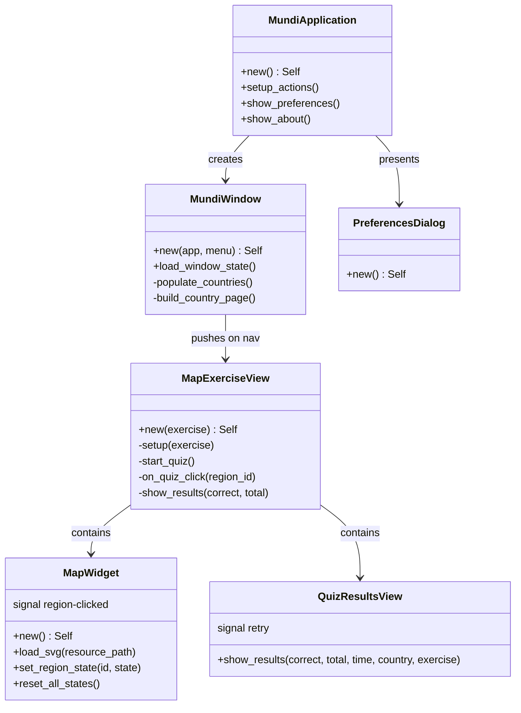
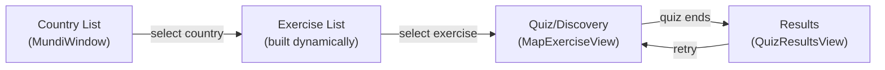
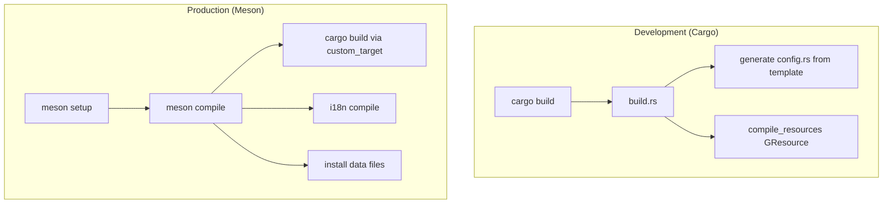

# Architecture
<!-- metadata: type=architecture, audience=ai-agents, scope=system-design -->

## Overview

Mundi follows the standard GNOME application architecture: a single `AdwApplication` subclass manages the lifecycle, creates an `AdwApplicationWindow`, and uses `AdwNavigationView` for stack-based page navigation. All UI components are GTK4 subclasses using the GObject type system with composite templates.

## Type Hierarchy



## Navigation Model



Navigation uses `AdwNavigationView` with programmatic page pushing. The country list is the root page (defined in `window.ui`). Exercise list pages and `MapExerciseView` pages are created dynamically and pushed onto the navigation stack.

## Key Architectural Patterns

### Data-Driven Registry

All countries and exercises are defined as static data in `registry.rs`. Adding a new country/exercise requires no new Rust types — only data entries and SVG maps. The registry pattern:

1. `Country` structs hold a static slice of `MapExercise` entries
2. `MapExercise` references an SVG resource path and a region name slice from `region_names.rs`
3. `countries()` returns a `&'static [Country]` — no allocation, no runtime registration

### GObject Subclass Pattern

Every UI component follows the GTK4 Rust subclass pattern:
- `mod imp` contains the private implementation struct with `#[derive(Default, gtk::CompositeTemplate)]`
- `ObjectSubclass` impl sets `NAME`, `Type`, `ParentType`
- `class_init` binds the template; `instance_init` initializes it
- `glib::wrapper!` macro generates the public type with `@extends` and `@implements`

### SVG Rendering Pipeline (No Cairo)

```mermaid
graph TD
    A["SVG Resource<br/>(GResource)"] -->|load_svg| B["quick-xml Parser"]
    B -->|extract path d + id| C["GskPath::parse()"]
    C --> D["Region Vec"]
    D -->|snapshot()| E["append_fill / append_stroke"]
    E --> F["GTK Compositor"]
```

Map rendering uses `GskPath` exclusively — no Cairo dependency. The `MapWidget::snapshot()` method:
1. Computes scale/translate to fit SVG bounds into widget allocation
2. Iterates regions, choosing fill color by `RegionState`
3. Calls `snapshot.append_fill()` and `snapshot.append_stroke()` for each path
4. Draws square markers on top for tiny regions and river midpoints

### Hit Detection

Click/motion events are transformed from widget coordinates to SVG coordinates, then tested against regions:
1. **Rivers**: `GskPath::closest_point()` with a distance threshold
2. **Tiny regions** (bounds < 8px): distance to center
3. **Normal regions**: `GskPath::in_fill()` with `FillRule::Winding`, preferring the smallest matching region

### SVG Conventions

SVG files use a custom ID-based convention:
- `id="RegionName"` — interactive region (Standard exercise)
- `id="_bg_RegionName"` — background outline (Capitals exercise)
- `id="__decorative"` — decorative paths (borders, insets) — prefix `__`
- `id="_river_RiverName"` — river paths (stroke-rendered, not filled)
- Path data: simple absolute `M L Z` commands only (no curves, no transforms)

### Build System



- **Cargo path**: `build.rs` generates `config.rs` from `config.rs.in` (substituting env vars) and compiles GResources. For development, env vars like `GSETTINGS_SCHEMA_DIR` must be set manually.
- **Meson path**: Wraps Cargo as a `custom_target`, passes version/paths via environment, handles i18n compilation, schema installation, desktop file generation, and icon installation.

### Persistence

| Data | Storage | Location |
|------|---------|----------|
| Window size/maximized | GSettings | `io.github.nacho.mundi.state.window` |
| Sound effects toggle | GSettings | `io.github.nacho.mundi` → `sound-effects` |
| Per-exercise stats (correct/total) | GSettings | `io.github.nacho.mundi.stats` with relocatable path |
| Leaderboard entries | JSON file | `$XDG_DATA_HOME/mundi/{country}-{exercise}.json` |

### Internationalization

- `N_()` macro marks strings for extraction without translating at definition time
- `gettext()` translates at runtime
- `i18n_fmt!` macro handles format strings with translated components
- `po/POTFILES.in` lists source and UI files for string extraction
- Meson `i18n.gettext()` compiles `.po` → `.mo` files
