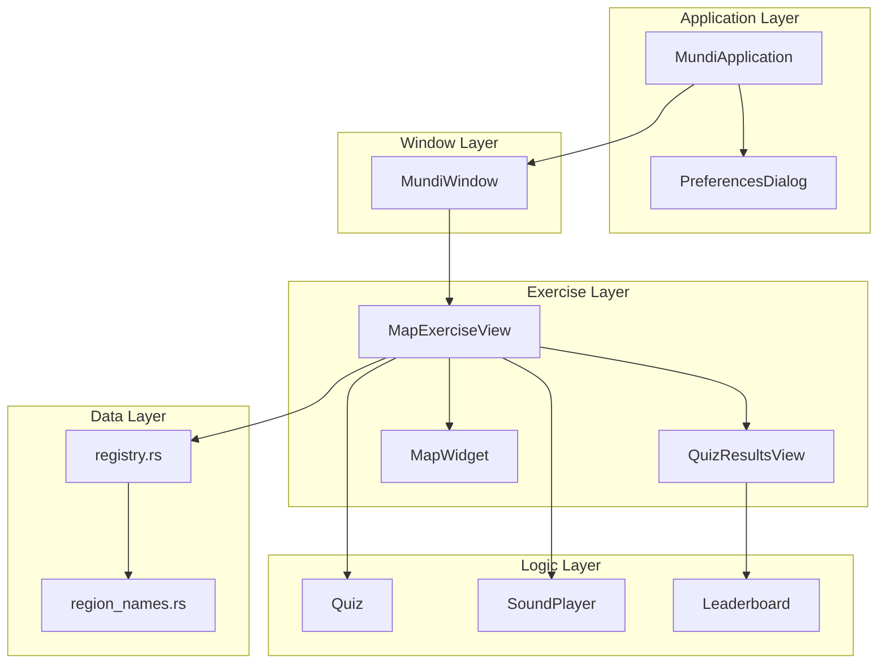

# Components
<!-- metadata: type=components, audience=ai-agents, scope=implementation -->

## Component Map

## GTK4 Subclass Components

### MundiApplication
<!-- metadata: file=src/application.rs, template=none -->

**Parent**: `adw::Application`

Application singleton managing lifecycle and global actions.

**Responsibilities**:
- Registers app actions: `quit`, `preferences`, `about`
- Sets keyboard accelerators (`Ctrl+Q`, `Ctrl+W`)
- Loads custom CSS from GResource on startup
- Creates `MundiWindow` on activate
- Presents `PreferencesDialog` and `adw::AboutDialog`

**Key detail**: CSS provider is loaded in `startup()` (once), not `activate()` (per-window). This is the standard GNOME pattern.

### MundiWindow
<!-- metadata: file=src/window.rs, template=resources/ui/window.ui -->

**Parent**: `adw::ApplicationWindow`

Main application window with country list navigation.

**Responsibilities**:
- Populates country list from `registry::countries()` as `AdwActionRow` entries
- Builds exercise list pages dynamically per country (with optional group headers)
- Pushes `MapExerciseView` onto `AdwNavigationView` when an exercise is selected
- Persists/restores window size and maximized state via GSettings

**Template children**: `navigation_view`, `countries_group`, `primary_menu_button`

**Properties**: `main-menu` (construct-only, nullable `gio::MenuModel`)

### MapExerciseView
<!-- metadata: file=src/map_exercise_view.rs, template=resources/ui/map_exercise_view.ui -->

**Parent**: `adw::NavigationPage`

Central controller for both discovery mode and quiz mode.

**Responsibilities**:
- Creates and configures `MapWidget` programmatically (inserted into template's `content_box`)
- **Discovery mode**: clicking a region shows its translated name in `discovery_label`
- **Quiz mode**: manages `Quiz` instance, timer, attempt tracking, sound playback
- Delegates results display to embedded `QuizResultsView`
- Saves per-exercise stats to GSettings on quiz completion
- Stops background music when navigating away (`connect_hiding`)

**Template children**: `header_title`, `timer_label`, `quiz_button`, `content_box`, `discovery_label`, `prompt_label`, `attempts_label`, `quiz_results_view`

**Key detail**: `MapWidget` is not in the template — it's created in `setup()` and inserted after `attempts_label`. This allows the map to be created with the correct exercise context.

### MapWidget
<!-- metadata: file=src/map_widget.rs, template=none -->

**Parent**: `gtk::Widget`

Custom widget for SVG map rendering and interaction.

**Responsibilities**:
- Parses SVG via `quick-xml`, extracting `<path>` elements with `id` and `d` attributes
- Supports `<circle>` elements for marker-based province matching
- Renders all regions using `GskPath` fill/stroke operations in `snapshot()`
- Handles click events (emits `region-clicked` signal) and motion events (hover highlighting)
- Manages per-region state: Normal, Highlighted, Correct, Wrong, Decorative, Background
- Draws square markers for tiny regions (bounds < 8px) and river midpoints
- Adapts colors to light/dark theme via `AdwStyleManager` notifications
- Caches named CSS colors (`map-region-color`, `map-region-highlight-color`, etc.)

**Signals**: `region-clicked(String)` — emitted when a clickable region is clicked

**Key detail**: Colors are resolved from CSS named colors using `style_context().lookup_color()`. The 5 cached colors are: normal, highlighted, correct, wrong, border.

### QuizResultsView
<!-- metadata: file=src/quiz_results_view.rs, template=resources/ui/quiz_results_view.ui -->

**Parent**: `gtk::Box`

Displays quiz results with score, time, and leaderboard.

**Responsibilities**:
- Shows score (fraction + percentage) and elapsed time
- Checks if score qualifies for leaderboard (top 50)
- Shows name entry if qualified, "didn't make top 50" message otherwise
- Saves leaderboard entry and refreshes display
- Populates leaderboard list with ranked entries (highlighted if just saved)

**Signals**: `retry` — emitted when retry button is clicked

**Template children**: `score_label`, `score_caption`, `time_label`, `time_caption`, `retry_button`, `name_box`, `name_entry`, `save_button`, `no_qualify_label`, `leaderboard_list`

### PreferencesDialog
<!-- metadata: file=src/preferences_dialog.rs, template=resources/ui/preferences_dialog.ui -->

**Parent**: `adw::PreferencesDialog`

Simple preferences with sound effects toggle.

**Responsibilities**:
- Binds `AdwSwitchRow` to GSettings `sound-effects` key
- Two-way binding: UI reflects stored value, changes persist immediately

**Template children**: `sound_effects_row`

## Non-Widget Components

### Quiz
<!-- metadata: file=src/quiz.rs -->

Pure logic component — no GTK dependency.

**Responsibilities**:
- Shuffles regions randomly on creation
- Tracks current question, attempts remaining (3 per question), and session score
- Handles alternate IDs (for dual-capital exercises)
- Scoring: 3 points for first attempt, 2 for second, 1 for third, 0 if all fail
- Advances automatically when attempts exhausted

### SoundPlayer
<!-- metadata: file=src/sound_player.rs -->

Audio playback wrapper.

**Responsibilities**:
- Wraps three `GtkMediaFile` instances: correct, wrong, quiz-music
- Checks `sound-effects` GSettings key before playing
- Music is looped at 50% volume; correct/wrong are one-shot
- All sounds loaded from GResource paths

### Leaderboard
<!-- metadata: file=src/leaderboard.rs -->

JSON-based persistent high score storage.

**Responsibilities**:
- Stores up to 50 entries per exercise
- Ranking: higher score first, then faster time
- Persists to `$XDG_DATA_HOME/mundi/{country}-{exercise}.json`
- `qualifies()` checks if a new score would make the top 50

### Registry Module
<!-- metadata: file=src/registry.rs -->

Static data definitions for all countries and exercises.

**Responsibilities**:
- Defines `Country` and `MapExercise` structs
- Contains static slices for each country's exercises
- `countries()` returns the complete `&'static [Country]` list
- Each `MapExercise` references its SVG resource path, region names, exercise kind, and alternates

### Region Names Module
<!-- metadata: file=src/region_names.rs -->

Translatable string constants for all map regions.

**Responsibilities**:
- Defines `N_()` macro (identity function that marks strings for gettext extraction)
- Contains `pub static` slices of `(&str, &str)` tuples: `(svg_path_id, translatable_name)`
- For capitals exercises: tuples are `(capital_name, region_name)`
