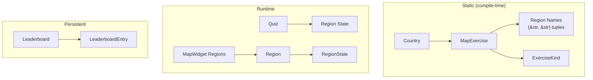

# Data Models
<!-- metadata: type=data-models, audience=ai-agents, scope=data-structures -->

## Overview

Mundi uses a layered data model: static registry data defines the exercise catalog, runtime structs manage quiz state and map rendering, and persistent models handle leaderboard storage.



## Static Registry Models

### Country

```rust
pub struct Country {
    pub id: &'static str,           // e.g. "spain", "world"
    name_msgid: &'static str,       // gettext message ID
    pub exercises: &'static [MapExercise],
}
```

- `id` is used for GSettings paths and leaderboard file names
- `name()` returns the translated country name via `gettext(name_msgid)`
- All instances are `&'static` — defined in `registry.rs`

### MapExercise

```rust
pub struct MapExercise {
    pub id: &'static str,                          // e.g. "communities", "provinces"
    pub country_id: &'static str,                   // back-reference to parent Country
    title_msgid: &'static str,                      // gettext message ID
    pub svg_resource: &'static str,                 // GResource path to SVG
    pub regions: &'static [(&'static str, &'static str)],  // (svg_id, name_msgid)
    pub group: Option<&'static str>,                // optional sub-group (e.g. "Galicia")
    pub kind: ExerciseKind,                         // Standard or Capitals
    pub alternates: &'static [(&'static str, &'static str)], // (alt_id, primary_id)
}
```

- `title()` returns the translated exercise title
- `stats_path()` returns `/io/github/nacho/mundi/stats/{country_id}/{exercise_id}/`
- `regions` tuples: for Standard exercises `(svg_path_id, region_name_msgid)`, for Capitals exercises `(capital_name, region_name_msgid)`
- `alternates` maps alternate SVG IDs to a primary ID (for dual-capital exercises)
- `group` enables sub-sections in the exercise list (e.g. "Galicia" under Spain)

### ExerciseKind

```rust
pub enum ExerciseKind {
    Standard,   // Click the named region
    Capitals,   // Click the capital dot for a named capital
}
```

Affects quiz prompt text, discovery mode label format, and SVG parsing behavior (background regions vs clickable dots).

### Region Names Convention

Region names are defined as static slices in `region_names.rs`:

```rust
// Standard exercise
pub static SPAIN_COMMUNITIES: &[(&str, &str)] = &[
    ("Andalucía", N_("Andalusia")),
    // ...
];

// Capitals exercise
pub static SPAIN_COMMUNITY_CAPITALS: &[(&str, &str)] = &[
    (N_("Seville"), N_("Andalusia")),
    // ...
];
```

The `N_()` macro is an identity function that marks strings for gettext extraction without translating them at definition time.

## Runtime Models

### Region

```rust
pub struct Region {
    pub id: String,
    pub path: gtk::gsk::Path,
    pub bounds: gtk::graphene::Rect,
    pub state: RegionState,
    pub is_river: bool,
}
```

Created by `MapWidget::parse_svg()`. Each `Region` corresponds to a `<path>` element in the SVG. The `id` is derived from the SVG `id` attribute with prefix stripping:

| SVG ID Pattern | Resulting `id` | `state` | `is_river` |
|---------------|----------------|---------|------------|
| `RegionName` | `RegionName` | Normal | false |
| `_bg_RegionName` | `RegionName` | Background | false |
| `__anything` | `__anything` | Decorative | false |
| `_river_RiverName` | `RiverName` | Normal | true |

### RegionState

```rust
pub enum RegionState {
    Normal,       // Default — clickable, uses map-region-color
    Highlighted,  // Mouse hover — uses map-region-highlight-color
    Correct,      // Answered correctly — uses map-region-correct-color
    Wrong,        // Failed all attempts — uses map-region-wrong-color
    Decorative,   // Non-interactive (borders, insets) — filled with border color
    Background,   // Capitals exercise outlines — filled normal, not clickable
}
```

State transitions:
- Normal ↔ Highlighted (mouse enter/leave)
- Normal → Correct (correct answer)
- Normal → Wrong (flash on wrong attempt, or permanent on exhausted attempts)
- Decorative and Background are immutable after SVG parsing

### Quiz

```rust
pub struct Quiz {
    regions: Vec<(String, String)>,    // shuffled (id, name_msgid)
    alternates: Vec<(String, String)>, // (alternate_id, primary_id)
    current: usize,                    // index into regions
    pub attempts_left: u32,            // 3, 2, 1, then advance
    pub session_correct: u32,          // accumulated score
    pub session_total: u32,            // regions.len() * 3
}
```

Scoring: `session_correct += attempts_left` on correct answer. Maximum score = `regions.len() * 3`. Percentage = `session_correct / session_total * 100`.

## Persistent Models

### LeaderboardEntry

```rust
#[derive(Clone, Serialize, Deserialize)]
pub struct LeaderboardEntry {
    pub name: String,      // player name
    pub score: u32,        // session_correct value
    pub total: u32,        // session_total value
    pub time_secs: u64,    // elapsed seconds
}
```

Ranking order: higher `score` first, then lower `time_secs` (faster is better).

### Leaderboard

```rust
pub struct Leaderboard {
    pub entries: Vec<LeaderboardEntry>,
}
```

- Maximum 50 entries per exercise
- File path: `$XDG_DATA_HOME/mundi/{country_id}-{exercise_id}.json`
- Format: JSON array of `LeaderboardEntry` objects (via `serde_json`)

Example JSON:
```json
[
  {"name": "Alice", "score": 51, "total": 51, "time_secs": 45},
  {"name": "Bob", "score": 48, "total": 51, "time_secs": 62}
]
```

## GSettings Data

Per-exercise statistics use the relocatable `io.github.nacho.mundi.stats` schema:

| Key | Type | Semantics |
|-----|------|-----------|
| `correct` | `uint` | Cumulative correct score across all sessions |
| `total` | `uint` | Cumulative total possible score across all sessions |

Path pattern: `/io/github/nacho/mundi/stats/{country_id}/{exercise_id}/`

Example: `/io/github/nacho/mundi/stats/spain/communities/`

## Build-Time Config

Generated from `src/config.rs.in` by `build.rs`:

```rust
pub const VERSION: &str = "0.9.0";
pub const APPLICATION_ID: &str = "io.github.nacho.mundi";
pub const PACKAGE: &str = "mundi";
pub const DATADIR: &str = "/usr/share";  // or env override
```

Values come from environment variables (set by Meson) or hardcoded defaults (for Cargo development builds).
