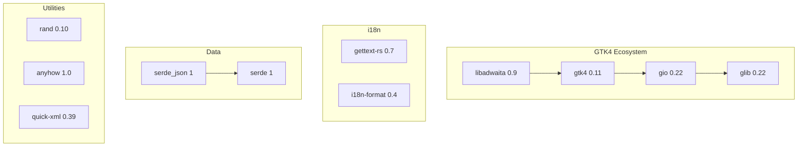

# Dependencies
<!-- metadata: type=dependencies, audience=ai-agents, scope=external-deps -->

## Cargo Dependencies

### Runtime Dependencies

| Crate | Version | Purpose |
|-------|---------|---------|
| `gtk4` (as `gtk`) | 0.11, feature `v4_14` | GTK4 Rust bindings — widgets, rendering, event handling |
| `libadwaita` | 0.9, feature `v1_5` | Adwaita design system — `AdwNavigationView`, `AdwApplicationWindow`, `AdwPreferencesDialog`, `AdwActionRow`, etc. |
| `gio` | 0.22 | GIO bindings — `GSettings`, `GResource`, `GAction`, `GApplication` |
| `glib` | 0.22, feature `log_macros` | GLib bindings — GObject type system, main loop, signals, closures |
| `gettext-rs` | 0.7, feature `gettext-system` | gettext i18n — `setlocale`, `bindtextdomain`, `textdomain`, `gettext` |
| `i18n-format` | 0.4, feature `legacy` | `i18n_fmt!` macro for format strings with translated components |
| `anyhow` | 1.0 | Error handling in `main()` / `run_application()` |
| `rand` | 0.10 | Quiz question shuffling (`SliceRandom`) |
| `serde` | 1, feature `derive` | Serialization derive macros for `LeaderboardEntry` |
| `serde_json` | 1 | JSON read/write for leaderboard files |
| `quick-xml` | 0.39 | SVG parsing — extracts `<path>` and `<circle>` elements from SVG resources |

### Build Dependencies

| Crate | Version | Purpose |
|-------|---------|---------|
| `glib-build-tools` | 0.22 | `compile_resources()` — compiles `resources.gresource.xml` into a binary GResource bundle |
| `regex` | 1.11 | Template variable substitution in `build.rs` (`@VAR@` → env value) |

## Dependency Relationships

## System Dependencies

Required for building (installed via system package manager):

| Package | Debian/Ubuntu | Purpose |
|---------|--------------|---------|
| GTK4 dev | `libgtk-4-dev` | GTK4 C headers and libraries |
| libadwaita dev | `libadwaita-1-dev` | Adwaita C headers and libraries |
| Meson | `meson` | Production build system |
| Ninja | `ninja-build` | Meson backend |
| gettext | `gettext` | Translation tools (`msgfmt`, `xgettext`) |
| desktop-file-utils | `desktop-file-utils` | Desktop file validation (CI) |
| Rust toolchain | via `rustup` | `rustc`, `cargo`, `rustfmt`, `clippy` |

## Design Principles

- **Minimal dependency set**: Only 11 runtime crates, all well-established
- **GTK4 ecosystem alignment**: All UI crates from the same `gtk-rs` release cycle (0.22 GLib generation)
- **No Cairo**: Map rendering uses `GskPath` exclusively — avoids the `cairo-rs` dependency
- **System gettext**: Uses `gettext-system` feature to link against the system's libintl rather than bundling one
- **Pinned editions**: Cargo.lock is committed, ensuring reproducible builds
