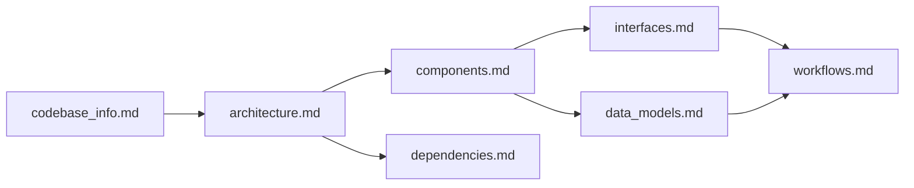

# Mundi Documentation Index
<!-- metadata: type=index, audience=ai-agents, scope=knowledge-base -->

## How to Use This Documentation

This index is the **primary entry point** for AI assistants working with the Mundi codebase. Start here to determine which file contains the information you need.

### Quick Decision Guide

| Question Type | Consult |
|--------------|---------|
| "What is this project?" | [codebase_info.md](codebase_info.md) |
| "How is the app structured?" | [architecture.md](architecture.md) |
| "What does component X do?" | [components.md](components.md) |
| "What signals/APIs exist?" | [interfaces.md](interfaces.md) |
| "What data structures are used?" | [data_models.md](data_models.md) |
| "How does feature X work end-to-end?" | [workflows.md](workflows.md) |
| "What crates/libraries are used?" | [dependencies.md](dependencies.md) |
| "What gaps exist in the docs?" | [review_notes.md](review_notes.md) |

## File Summaries

### [codebase_info.md](codebase_info.md)
<!-- metadata: scope=project-overview -->
Project identity, technology stack, directory structure, source file responsibilities, and map coverage. Start here for orientation.

### [architecture.md](architecture.md)
<!-- metadata: scope=system-design -->
GTK4 subclass pattern, GObject type hierarchy, AdwNavigationView navigation model, data-driven registry pattern, GskPath rendering pipeline, build system architecture (dual Meson/Cargo), and GResource bundling. Includes Mermaid diagrams for component relationships and navigation flow.

### [components.md](components.md)
<!-- metadata: scope=implementation -->
Detailed documentation of each GTK4 subclass: `MundiApplication`, `MundiWindow`, `MapExerciseView`, `MapWidget`, `QuizResultsView`, `PreferencesDialog`. Also covers non-widget components: `Quiz`, `SoundPlayer`, `Leaderboard`, and the registry module. Describes responsibilities, key methods, and inter-component relationships.

### [interfaces.md](interfaces.md)
<!-- metadata: scope=apis-signals -->
GObject signals (`region-clicked`, `retry`), GSettings schema keys, GResource paths, public API surfaces of each component, and UI template bindings. Essential for understanding how components communicate.

### [data_models.md](data_models.md)
<!-- metadata: scope=data-structures -->
Core data structures: `Country`, `MapExercise`, `ExerciseKind`, `Region`, `RegionState`, `Quiz`, `LeaderboardEntry`, `Leaderboard`. Covers the static registry data model, SVG path conventions, and JSON persistence format.

### [workflows.md](workflows.md)
<!-- metadata: scope=user-flows -->
End-to-end flows: application startup, discovery mode interaction, quiz lifecycle (start → answer → results → leaderboard), adding new countries/exercises, adding capitals exercises, build and release processes.

### [dependencies.md](dependencies.md)
<!-- metadata: scope=external-deps -->
All Cargo dependencies and system dependencies with their purposes. Covers GTK4/libadwaita crate ecosystem, serialization stack, i18n tooling, and build-time dependencies.

### [review_notes.md](review_notes.md)
<!-- metadata: scope=quality -->
Documentation consistency check results, completeness gaps, and recommendations for improvement.

## Cross-Reference Map

- **architecture.md** ↔ **components.md**: Architecture describes the patterns; components describes the implementations
- **interfaces.md** ↔ **components.md**: Interfaces lists the signals and APIs; components explains when they're used
- **data_models.md** ↔ **workflows.md**: Data models defines structures; workflows shows how data flows through them
- **dependencies.md** ↔ **architecture.md**: Dependencies lists external crates; architecture explains how they fit into the design
