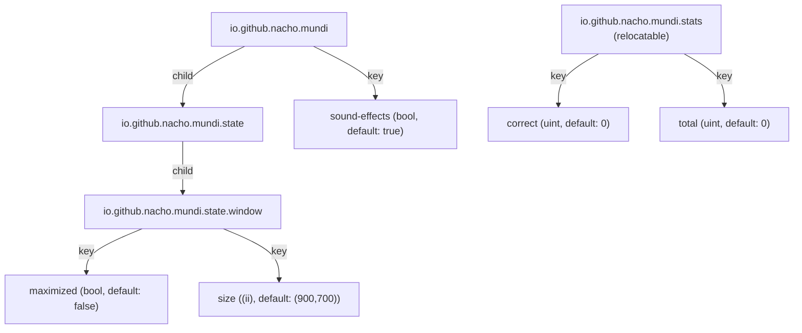

# Interfaces
<!-- metadata: type=interfaces, audience=ai-agents, scope=apis-signals -->

## GObject Signals

### MapWidget — `region-clicked`

| Property | Value |
|----------|-------|
| Source | `MapWidget` (`src/map_widget.rs`) |
| Parameter | `String` — the SVG path `id` of the clicked region |
| Emitted when | User clicks on a region that passes hit detection |
| Connected by | `MapExerciseView::setup()` via `connect_closure` |

The signal is the sole communication channel from `MapWidget` to its parent. `MapExerciseView` routes it to either discovery mode (show name) or quiz mode (check answer).

### QuizResultsView — `retry`

| Property | Value |
|----------|-------|
| Source | `QuizResultsView` (`src/quiz_results_view.rs`) |
| Parameters | None |
| Emitted when | User clicks the "Retry" button |
| Connected by | `MapExerciseView::setup()` via `connect_closure` |

Triggers a new quiz with the same exercise.

## GObject Properties

### MundiWindow — `main-menu`

| Property | Value |
|----------|-------|
| Type | `Option<gio::MenuModel>` |
| Flags | Construct-only, nullable |
| Set by | `MundiApplication::activate()` |
| Effect | Assigned to the `GtkMenuButton` in the header bar |

## GSettings Schema

Schema ID: `io.github.nacho.mundi`



### Key Details

| Schema | Key | Type | Default | Used By |
|--------|-----|------|---------|---------|
| `io.github.nacho.mundi` | `sound-effects` | `bool` | `true` | `SoundPlayer`, `PreferencesDialog` |
| `io.github.nacho.mundi.state.window` | `maximized` | `bool` | `false` | `MundiWindow` |
| `io.github.nacho.mundi.state.window` | `size` | `(ii)` | `(900, 700)` | `MundiWindow` |
| `io.github.nacho.mundi.stats` | `correct` | `uint` | `0` | `MapExerciseView` |
| `io.github.nacho.mundi.stats` | `total` | `uint` | `0` | `MapExerciseView` |

The `stats` schema is **relocatable** — instantiated with a dynamic path per exercise: `/io/github/nacho/mundi/stats/{country_id}/{exercise_id}/`

## GResource Paths

All resources are under the prefix `/io/github/nacho/mundi/`:

| Path | Type | Used By |
|------|------|---------|
| `gtk/menus.ui` | Menu definition | `MundiApplication` (via `menu_by_id`) |
| `ui/window.ui` | Composite template | `MundiWindow` |
| `ui/map_exercise_view.ui` | Composite template | `MapExerciseView` |
| `ui/quiz_results_view.ui` | Composite template | `QuizResultsView` |
| `ui/preferences_dialog.ui` | Composite template | `PreferencesDialog` |
| `style.css` | Custom CSS | `MundiApplication::startup()` |
| `maps/{country}/{exercise}.svg` | SVG map data | `MapWidget::load_svg()` |
| `sounds/correct.oga` | Audio | `SoundPlayer` |
| `sounds/wrong.oga` | Audio | `SoundPlayer` |
| `sounds/quiz-music.oga` | Audio | `SoundPlayer` |

## Public API Surfaces

### MapWidget

```rust
pub fn new() -> Self
pub fn load_svg(&self, resource_path: &str)
pub fn region_state(&self, region_id: &str) -> RegionState
pub fn set_region_state(&self, region_id: &str, state: RegionState)
pub fn reset_all_states(&self)
// Signal: "region-clicked" -> String
```

### Quiz

```rust
pub fn new(regions: &[(&str, &str)], alternates: &[(&str, &str)]) -> Self
pub fn current_id(&self) -> Option<&str>
pub fn current_name(&self) -> Option<&str>
pub fn is_finished(&self) -> bool
pub fn answer(&mut self, region_id: &str) -> bool
pub fn session_percentage(&self) -> f64
// Public fields: attempts_left, session_correct, session_total
```

### Leaderboard

```rust
pub fn load(country_id: &str, exercise_id: &str) -> Self
pub fn save(&self, country_id: &str, exercise_id: &str)
pub fn qualifies(&self, score: u32, total: u32, time_secs: u64) -> bool
pub fn insert(&mut self, entry: LeaderboardEntry) -> usize
// Public field: entries: Vec<LeaderboardEntry>
```

### Registry

```rust
pub fn countries() -> &'static [Country]
// Country: pub id, pub exercises, pub fn name() -> String
// MapExercise: pub id, pub country_id, pub svg_resource, pub regions,
//              pub group, pub kind, pub alternates, pub fn title() -> String,
//              pub fn stats_path() -> String
```

## CSS Named Colors

Defined in `resources/style.css`, resolved by `MapWidget` for rendering:

| Color Name | Purpose | Definition |
|-----------|---------|------------|
| `map-region-color` | Normal region fill | `@view_bg_color` |
| `map-region-highlight-color` | Hover highlight | `mix(@accent_bg_color, @view_bg_color, 0.4)` |
| `map-region-correct-color` | Correct answer | `@success_bg_color` |
| `map-region-wrong-color` | Wrong answer | `@error_bg_color` |
| `map-border-color` | Region borders | `@borders` |

These reference Adwaita named colors, so they automatically adapt to light/dark themes.

## Application Actions

| Action | Scope | Accelerator | Handler |
|--------|-------|-------------|---------|
| `app.quit` | Application | `Ctrl+Q` | `app.quit()` |
| `app.preferences` | Application | — | `show_preferences()` |
| `app.about` | Application | — | `show_about()` |
| `window.close` | Window | `Ctrl+W` | GTK built-in |
