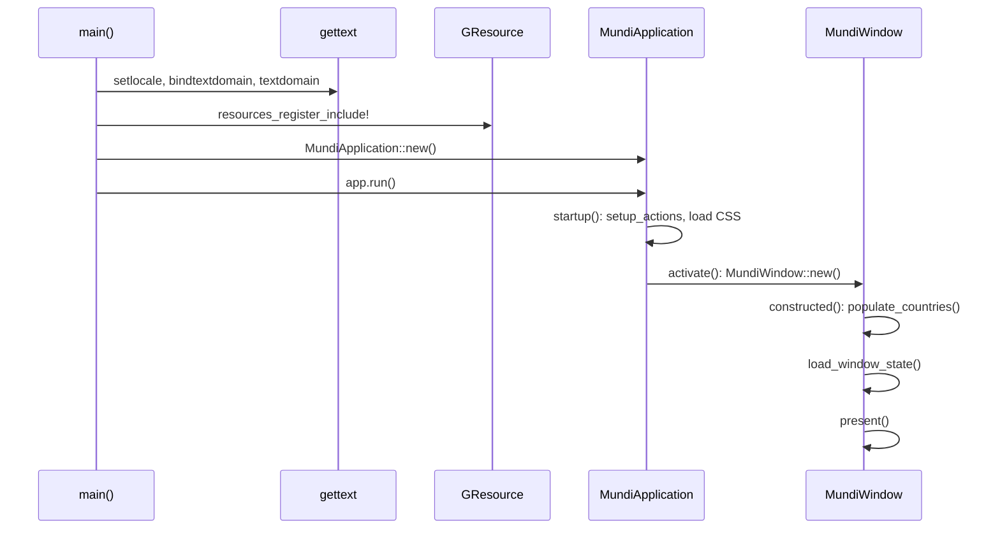
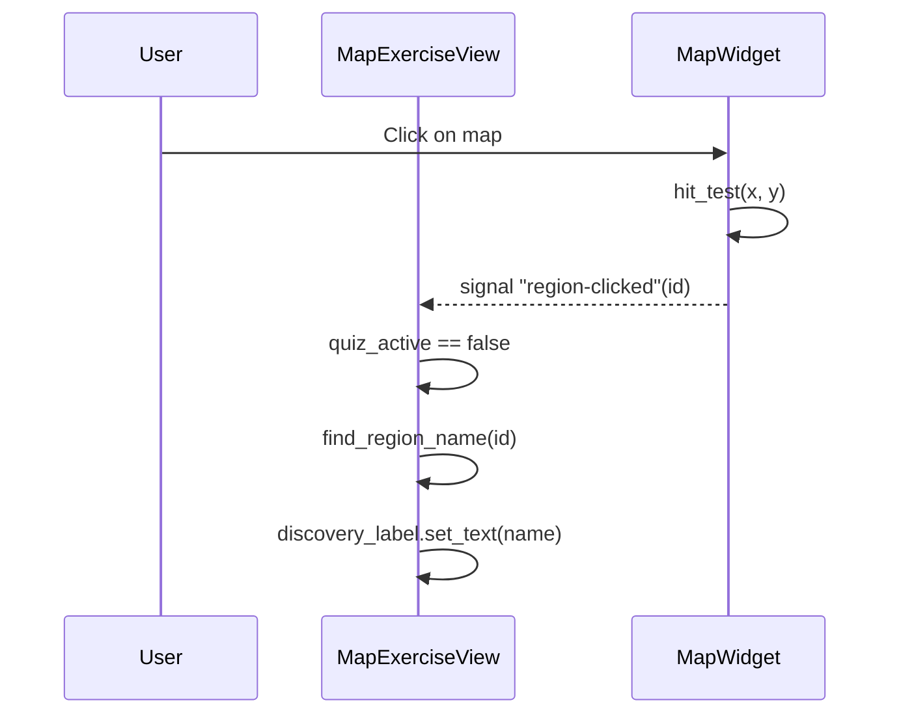
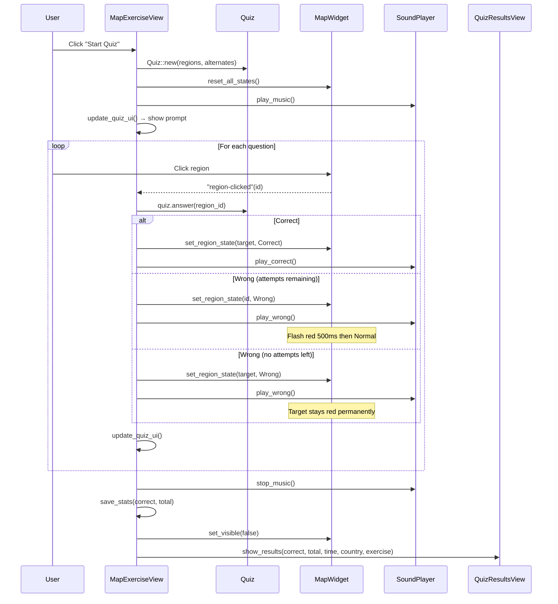
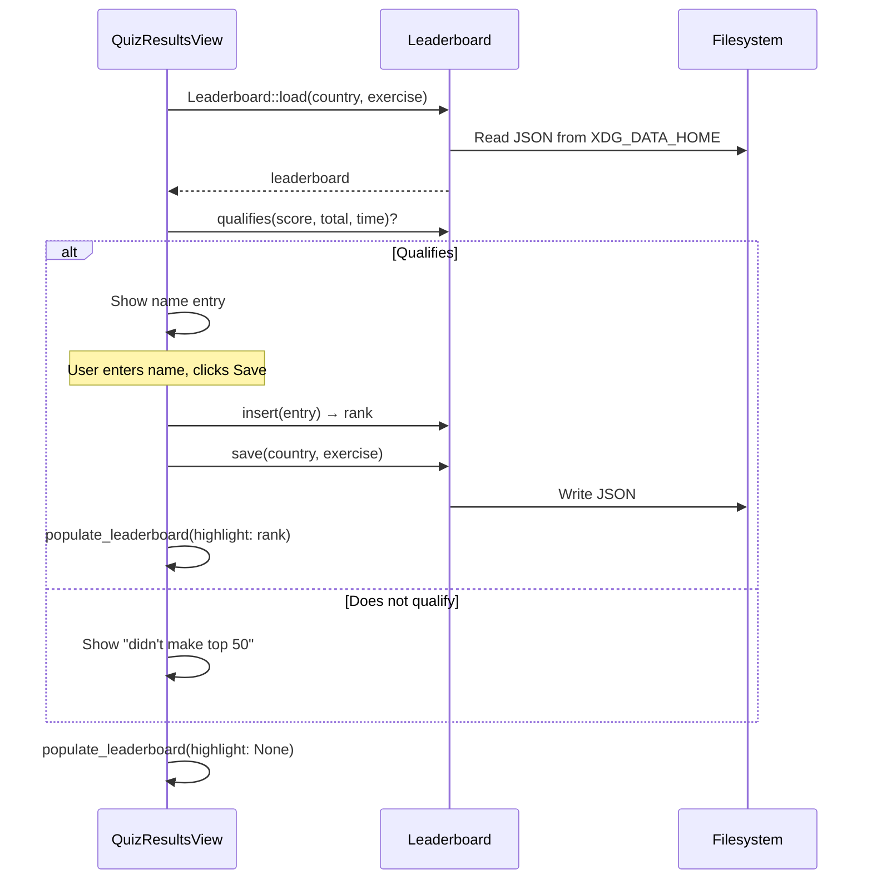
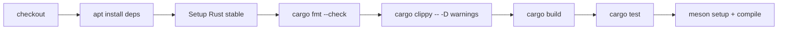

# Workflows
<!-- metadata: type=workflows, audience=ai-agents, scope=user-flows -->

## Application Startup



Key points:
1. i18n is initialized before any GTK code runs
2. GResource bundle is registered once at startup
3. CSS provider is loaded in `startup()` (runs once per app lifetime)
4. `activate()` creates the window (runs each time the app is activated)

## Discovery Mode



In discovery mode (default when entering an exercise), clicking any region shows its translated name. For capitals exercises, the label shows "Capital, capital of Region".

## Quiz Lifecycle



### Quiz Scoring Detail

- Each question starts with 3 attempts
- Correct on 1st attempt: +3 points
- Correct on 2nd attempt: +2 points
- Correct on 3rd attempt: +1 point
- All attempts exhausted: +0 points, target region turns red permanently
- Total possible = `num_regions × 3`
- Percentage = `session_correct / session_total × 100`

### Timer

- Starts when quiz begins (`Instant::now()`)
- Updates every second via `glib::timeout_add_local`
- Displayed as `M:SS` in the header bar
- Stopped when quiz finishes; elapsed time passed to results view

## Leaderboard Flow



## Adding a New Country/Exercise

1. **Create SVG map**: `resources/maps/{country}/{exercise}.svg`
   - Each clickable region: `<path id="RegionName" d="M ... L ... Z"/>`
   - Decorative elements: `<path id="__border" d="..."/>`
   - Path data: absolute `M L Z` only (no curves, no transforms)

2. **Add region names**: In `src/region_names.rs`, add a new static slice:
   ```rust
   pub static COUNTRY_REGIONS: &[(&str, &str)] = &[
       ("SvgId", N_("Translated Name")),
       // ...
   ];
   ```

3. **Register exercise**: In `src/registry.rs`:
   - Create a `static COUNTRY_EXERCISES: &[MapExercise]` array
   - Add a `Country` entry to the `COUNTRIES` slice in `countries()`

4. **Register GResource**: Add the SVG path to `resources/resources.gresource.xml`

5. **Update translations**: Add `src/region_names.rs` to `po/POTFILES.in` (already listed), then regenerate the `.pot` file

## Adding a Capitals Exercise

Same as above, plus:

1. **SVG format**: Background outlines use `_bg_` prefix IDs; clickable dots are 1×1 `<path>` squares with capital name as ID
2. **Region names**: Tuples are `(capital_name, region_name)` instead of `(svg_id, region_name)`
3. **Exercise kind**: Set `kind: ExerciseKind::Capitals`
4. **Dual capitals**: Use `alternates: &[("AltCapital", "PrimaryCapital")]`

## Build Workflow

### Development

```bash
glib-compile-schemas data/          # Compile GSettings schema
GSETTINGS_SCHEMA_DIR=data cargo run # Run with local schema
```

### Production (Meson)

```bash
meson setup builddir
meson compile -C builddir
# Installs: binary, schemas, desktop file, icon, translations, metainfo
```

### CI Pipeline



Runs on push/PR to `main`. Checks formatting, lints, builds, tests, and verifies Meson build.

## Release Workflow

1. Update version in `Cargo.toml` and `meson.build`
2. Add release entry in `data/io.github.nacho.mundi.metainfo.xml`
3. Run `cargo fmt` and `cargo update -p mundi`
4. Commit: `git commit -am "Release X.Y.Z"`
5. Tag: `git tag vX.Y.Z`
6. Push: `git push && git push --tags`
